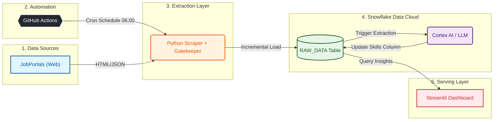

# 📡 Job Radar ID: AI-Powered Data Engineering Market Tracker


## 📖 Project Overview

The Data Engineering landscape in Indonesia is evolving rapidly. Job descriptions are the single source of truth for understanding what skills companies actually demand versus hype.

**Job Radar ID** is an end-to-end Data Engineering project that brings transparency to this market. Unlike traditional trackers that rely on simple keyword matching, this project utilizes **Snowflake Cortex AI (LLM)** to intelligently read, understand, and extract specific Hard & Soft skills from unstructured job descriptions.

[View Demo](https://bwahyuh-job-radar.streamlit.app/)

**Primary Objectives:**
1.  **AI-Powered Extraction:** Use Large Language Models (Claude 3.5 Sonnet via Snowflake Cortex) to parse complex job descriptions.
2.  **Automated Incremental Load:** A fully automated pipeline that fetches new jobs daily without duplicates.
3.  **ELT Demonstration:** Showcase a modern **Extract, Load, Transform (ELT)** pipeline using Serverless architecture.

---

## 🗺️ Project Roadmap

- [x] **Phase 1: Ingestion Engine** (Scraper with Role Gatekeeper)
- [x] **Phase 2: Cloud Storage Setup** (Snowflake Warehouse & Database)
- [x] **Phase 3: Data Loading** (Incremental Loading Logic with Deduplication)
- [x] **Phase 4: Transformation (The Brain)** (Skill Extraction using Snowflake Cortex/LLM)
- [x] **Phase 5: Orchestration** (Automated Daily Runs via GitHub Actions)
- [x] **Phase 6: Visualization** (Streamlit Dashboard Deployed)

---

## 🏗️ Architecture Blueprint

The system follows a modern **Serverless ELT paradigm**, leveraging GitHub Actions for orchestration and Snowflake for storage & compute.



### 🔄 Data Flow Description

1. **Orchestration (The Commander):** **GitHub Actions** triggers the pipeline automatically every day at 06:00 WIB (23:00 UTC).
2. **Extraction (The Scout):** A Python-based scraper fetches job listings. It includes a **Gatekeeper** logic to strictly filter titles (ensuring Data Engineering relevance).
3. **Load (The Transport):** The script checks `RAW_DATA.JOB_POSTINGS` for existing links. Only **new, unique jobs** are uploaded (Incremental Load).
4. **AI Transformation (The Brain):** A Python script triggers **Snowflake Cortex (`claude-3-5-sonnet`)**. The LLM reads the description and extracts skills into structured JSON format.
5. **Visualization (The Face):** A Streamlit app connects to Snowflake to visualize the top demanded skills in real-time.

---

## 🛠️ Tech Stack

| Domain | Technology | Justification |
| --- | --- | --- |
| **Orchestration** | **GitHub Actions** | Zero-cost, serverless automation to run daily batch jobs. |
| **Ingestion** | Python 3.10+ | Utilizes `requests` and `BeautifulSoup` for robust scraping. |
| **Data Warehouse** | Snowflake | Scalable storage handling structured and semi-structured data. |
| **AI / LLM** | **Snowflake Cortex** | Serverless access to **Claude 3.5 Sonnet** for high-accuracy text extraction (No external API keys needed). |
| **Visualization** | Streamlit | Interactive dashboard deployed on Streamlit Community Cloud. |

---

## 🚀 Quick Start (Local Development)

### 1. Prerequisites

* Python 3.10+
* Snowflake Account (Standard Edition or higher for Cortex support)
* Git

### 2. Installation

Clone the repository and set up the environment:

```bash
# Clone repository
git clone [https://github.com/bwahyuh/JOB-RADAR.git](https://github.com/bwahyuh/JOB-RADAR.git)

# Create Virtual Environment
python -m venv venv
source venv/bin/activate  # On Windows: venv\Scripts\activate

# Install dependencies
pip install -r requirements.txt

```

### 3. Configuration 🔐

Create a `.env` file in the root directory. **Do not commit this file.**

```ini
SNOWFLAKE_USER=your_username
SNOWFLAKE_PASSWORD=your_password
SNOWFLAKE_ACCOUNT=your_account_locator
SNOWFLAKE_WAREHOUSE=JOB_RADAR_WH
SNOWFLAKE_DATABASE=JOB_RADAR_DB
SNOWFLAKE_SCHEMA=RAW_DATA

```

### 4. Running Manually

```bash
# Step 1: Run Pipeline (Scrape -> Load -> Transform)
python src/scraper.py
python src/loader.py
python src/transformer.py

# Step 2: Launch Dashboard
streamlit run src/dashboard.py

```

---

## ⚙️ CI/CD Automation Setup

To enable the daily automation on your own GitHub repository:

1. Go to your Repository **Settings** > **Secrets and variables** > **Actions**.
2. Click **New repository secret**.
3. Add the following secrets (values from your `.env`):
* `SNOWFLAKE_ACCOUNT`
* `SNOWFLAKE_DATABASE`
* `SNOWFLAKE_PASSWORD`
* `SNOWFLAKE_SCHEMA`
* `SNOWFLAKE_USER`
* `SNOWFLAKE_WAREHOUSE`


The workflow file is located at `.github/workflows/daily_pipeline.yml`.

---

## 👨‍💻 Author

**[Bagas Wahyu Herdiansyah](https://www.linkedin.com/in/bagas-wahyu-herdiansyah/)**
