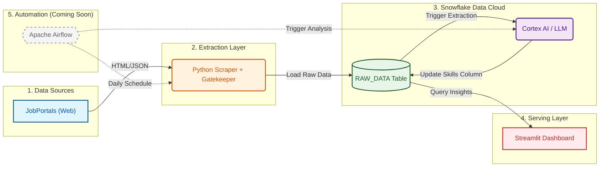

# 📡 Job Radar ID: AI-Powered Data Engineering Market Tracker


## 📖 Project Overview

The Data Engineering landscape in Indonesia is evolving rapidly. Job descriptions are the single source of truth for understanding what skills companies actually demand versus hype.

**Job Radar ID** is an end-to-end Data Engineering project that brings transparency to this market. Unlike traditional trackers that rely on simple keyword matching, this project utilizes **Snowflake Cortex AI (LLM)** to intelligently read, understand, and extract specific Hard & Soft skills from unstructured job descriptions.

**Primary Objectives:**
1.  **AI-Powered Extraction:** Use Large Language Models (Claude 3.5 Sonnet) to parse complex job descriptions.
2.  **Quality Control:** Implement a "Gatekeeper" system to filter out irrelevant roles (e.g., Sales, Marketing) ensuring 100% Data Engineering relevance.
3.  **ELT Demonstration:** Showcase a modern **Extract, Load, Transform (ELT)** pipeline using Snowflake's native AI capabilities.

---

## 🗺️ Project Roadmap

- [x] **Phase 1: Ingestion Engine** (Scraper V3 with Role Gatekeeper)
- [x] **Phase 2: Cloud Storage Setup** (Snowflake Warehouse & Database)
- [x] **Phase 3: Data Loading** (Automated CSV to Snowflake Pipeline)
- [x] **Phase 4: Transformation (The Brain)** (Skill Extraction using Snowflake Cortex/LLM)
- [x] **Phase 5: Visualization** (Streamlit Dashboard Deployed)
- [ ] **Phase 6: Orchestration** (Automating the flow with Apache Airflow - *Coming Soon*)

---

## 🏗️ Architecture Blueprint

The system follows a modern **ELT paradigm**, leveraging Snowflake not just for storage, but as the primary compute engine for AI processing.



### 🔄 Data Flow Description

1. **Extraction (The Scout):** A Python-based scraper fetches job listings. It includes a **Gatekeeper** logic that strictly filters titles (rejecting "Sales", "Marketing", etc.) to ensure data purity.
2. **Load (The Transport):** Raw text data is loaded into `RAW_DATA.JOB_POSTINGS` in Snowflake.
3. **AI Transformation (The Brain):** A Python script triggers **Snowflake Cortex (`claude-3-5-sonnet`)**. The LLM reads the full job description and extracts:
* Hard Skills (Python, SQL, Spark)
* Soft Skills (Communication, Leadership)
* Domain Knowledge (Banking, ETL)


4. **Visualization (The Face):** A Streamlit app connects to Snowflake, filters for unique job postings, and visualizes the top demanded skills in real-time.

---

## 🛠️ Tech Stack

| Domain | Technology | Justification |
| --- | --- | --- |
| **Ingestion** | Python 3.9+ | Utilizes `requests` and `BeautifulSoup` for robust scraping. |
| **Data Warehouse** | Snowflake | Scalable storage handling structured and semi-structured data. |
| **AI / LLM** | **Snowflake Cortex** | Serverless access to **Claude 3.5 Sonnet** for high-accuracy text extraction (No external API keys needed). |
| **Transformation** | SQL + Python | Logic defined in SQL, executed via Python connector. |
| **Visualization** | Streamlit | Interactive dashboard deployed on Streamlit Community Cloud. |

---

## 🚀 Quick Start (Local Development)

### 1. Prerequisites

* Python 3.9+
* Snowflake Account (Standard Edition or higher for Cortex support)
* Git

### 2. Installation

Clone the repository and set up the environment:

```bash
# Clone repository
git clone https://github.com/bwahyuh/JOB-RADAR.git

# Create Virtual Environment
python -m venv venv
source venv/bin/activate  # On Windows: venv\Scripts\activate

# Install dependencies
pip install -r requirements.txt

```

### 3. Configuration 🔐

Create a `.env` file in the root directory. **Do not commit this file.**

```ini
SNOWFLAKE_USER=your_username
SNOWFLAKE_PASSWORD=your_password
SNOWFLAKE_ACCOUNT=your_account_locator
SNOWFLAKE_WAREHOUSE=JOB_RADAR_WH
SNOWFLAKE_DATABASE=JOB_RADAR_DB
SNOWFLAKE_SCHEMA=RAW_DATA

```

### 4. Running the Pipeline

**Step 1: Scrape Data**
Fetch the latest job listings (Gatekeeper active).

```bash
python src/scraper.py

```

**Step 2: Load to Cloud**
Upload raw CSV to Snowflake.

```bash
python src/loader.py

```

**Step 3: Run AI Extraction**
Trigger Snowflake Cortex to extract skills from descriptions.

```bash
python src/transformer.py

```

*Note: This utilizes Snowflake credits.*

**Step 4: Launch Dashboard**
View the results locally.

```bash
streamlit run src/dashboard.py

```

---

## 👨‍💻 Author

**[Bagas Wahyu Herdiansyah](https://www.linkedin.com/in/bagas-wahyu-herdiansyah/)**
